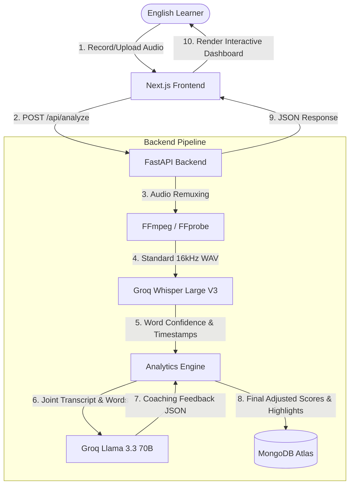

# LivoSpeak AI — System Architecture & DPDP Compliance Document

This document outlines the core architecture, model rationales, scoring algorithm, and compliance posture for **LivoSpeak AI** (LivoSpeak MVP 1.0).

---

## 1. System Components & Connections

LivoSpeak AI uses a decoupled client-server architecture designed for high-performance, low-latency analysis, and complete data privacy.



### Component Details
1. **Frontend (Next.js 15 / Tailwind CSS)**: Implements an interactive drag-and-drop uploader, a custom MediaRecorder audio wrapper, and a dynamic speaking dashboard with syllable coaching and an interactive, clickable word-level transcript.
2. **Backend (FastAPI)**: Serves as a lightweight API gateway. Orchestrates audio remuxing, sends requests to the Groq APIs, executes the scoring algorithm, and logs telemetry.
3. **Database (MongoDB)**: Stores text-only session metadata (transcripts, WPM, scores, timestamps, and practice plans). Uses `Motor` for asynchronous non-blocking queries.
4. **Processing Layer (FFmpeg/FFprobe)**: Resamples incoming audio streams to 16kHz mono WAV, resolving browser-native WebM/OGG container metadata limitations (e.g., missing duration values).

---

## 2. Models & APIs Used (and Rationale)

| Capability | Model / Service | Alternatives Considered | Rationale for Selection |
| :--- | :--- | :--- | :--- |
| **Speech-to-Text (STT)** | **Groq Whisper Large V3** | Local Whisper.cpp, Google STT, AssemblyAI | **Sub-second latency** (< 1s for a 60s file). Standard Whisper response formats did not include word confidence, but Groq's `verbose_json` format delivers precise word-level confidence and start/end timestamps. |
| **Speech Coaching (LLM)** | **Llama 3.3 70B (Versatile)** | OpenAI GPT-4o, Local Llama 3.1 8B | Performs expert linguistic analysis (generating IPAs, syllable stress guides, and tongue twisters) with **zero user data retention** policy under Groq. Strict JSON-mode output ensures the backend parser never breaks. |
| **Database Driver** | **Motor (Async PyMongo)** | PyMongo (Sync), SQLite | Prevents blocking the FastAPI async event loop during concurrent history queries, keeping the backend highly scalable. |

---

## 3. Pronunciation Scoring & Highlight Logic

To solve the issue of Whisper being overly generous (Whisper corrects accents to decode the intended words, yielding 95%+ confidence scores even for slurred speech), we implemented a **Hybrid STT-LLM Scoring Pipeline**:

```
                    ┌───────────────────────────────┐
                    │  Whisper Word Confidence (Base)│
                    └───────────────┬───────────────┘
                                    ▼
                    ┌───────────────────────────────┐
                    │ Llama 3.3 Transcript Analysis  │
                    │   (Flags up to 5 real errors)  │
                    └───────────────┬───────────────┘
                                    ▼
                    ┌───────────────────────────────┐
                    │      Score Deductions:        │
                    │  -6 pts/mistake (Pron.)       │
                    │  -5 pts/mistake (Clarity)     │
                    └───────────────┬───────────────┘
                                    ▼
                    ┌───────────────────────────────┐
                    │  Final Rigorous Speaking Score│
                    └───────────────────────────────┘
```

1. **Pronunciation Score**:
   - Calculated starting from the average of Whisper’s word confidences (scaled between 45% and 99%).
   - We deduct **6 points for every actual pronunciation mistake** identified by the LLM (up to a maximum 30-point deduction).
2. **Speech Clarity**:
   - Compares the ratio of high-confidence words to total words.
   - Deducts **5 points for each LLM-flagged error** (up to a 25-point deduction).
3. **Speech Fluency**:
   - Matches words against speaking rates: optimal range is 110–145 WPM. Deducts points proportionally for speaking too slowly or too quickly.
   - Detects pauses longer than 1.2 seconds, deducting **4 points per pause** (up to a 20-point deduction).
4. **Visual Highlights**:
   - Any word returned in the LLM's `mistakes` list is matched back to the full word-level transcript array by stripping punctuation and comparing lowercase values.
   - The matching words are marked with `is_mistake: true`, rendering them in **rose/red** on the interactive frontend transcript.

---

## 4. India DPDP Act 2023 Compliance

LivoSpeak AI implements "Privacy-by-Design" in accordance with India’s Digital Personal Data Protection (DPDP) Act 2023:

*   **1. Zero Audio Retention (Data Minimization)**:
    - User audio files are treated as ephemeral.
    - Files are processed entirely in memory or written to a secure temporary directory (`temp_uploads/`).
    - A `finally` block in the FastAPI endpoint guarantees the physical deletion of both the original uploaded file and its transcoded WAV version **immediately** after analysis is complete.
*   **2. Data Security & Encryption**:
    - Ephemeral audio transfers are encrypted in transit over HTTPS (using SSL/TLS).
*   **3. Explicit Consent**:
    - The UI presents a clear compliance notice indicating how speech data is handled.
    - The action of uploading a file or clicking "Analyze Speech" constitutes explicit, affirmative consent for processing that specific sample.
*   **4. Text-Only Storage (Purpose Limitation)**:
    - MongoDB stores only the text transcript, metrics, and coaching feedback.
    - No voiceprints, biometric data, or audio files are persisted, eliminating the risk of voice profile leaks.
*   **5. Right to Erasure (Data Principal Rights)**:
    - Implemented an individual **"Delete Session History"** button (trash bin icon) next to each history card.
    - Clicking this triggers a `DELETE` API call that instantly purges the text analytics record from the MongoDB cluster.

---

## 5. Architectural Trade-offs & Next Steps

### Trade-offs Made
*   **No Audio Playback in History**: Because we delete the audio files instantly for DPDP compliance, users cannot listen to their past recordings (they can only listen to their live recording before navigating away). Storing audio securely would require encrypted S3 buckets and user authentication.
*   **API-Based Phonetic Analysis**: Rather than deploying a heavy phoneme-alignment model (like Wav2Vec2) which would require expensive GPU hosting, we leverage Groq's fast Whisper timestamps combined with Llama 3.3's linguistic intelligence to achieve sub-3-second evaluations.

### Next Steps (If we had another week)
1. **User Authentication & Scoped Databases**: Integrate Auth0 or NextAuth to prevent public database history exposure, scoping the MongoDB history to the authenticated user ID.
2. **Acoustic Phoneme Comparison**: Integrate a lightweight, open-source acoustic phoneme recognizer (like Epitran or a Wav2Vec2-Phoneme model) to compare the audio directly against a standard reference phoneme dictionary.
3. **Pronunciation Trends Graph**: Add a Recharts-based line graph on the landing page to plot Pronunciation Accuracy, Fluency, and Clarity trends over time across all historical runs.
